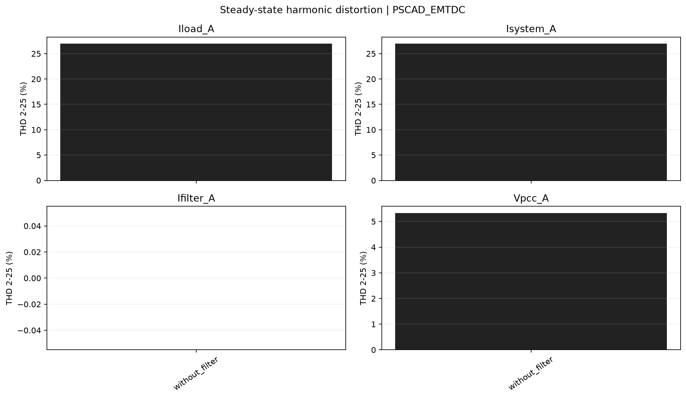
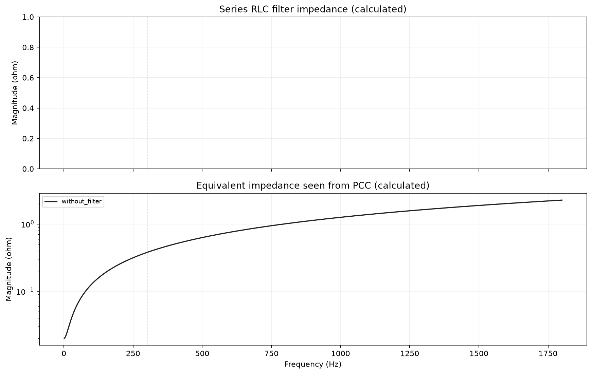
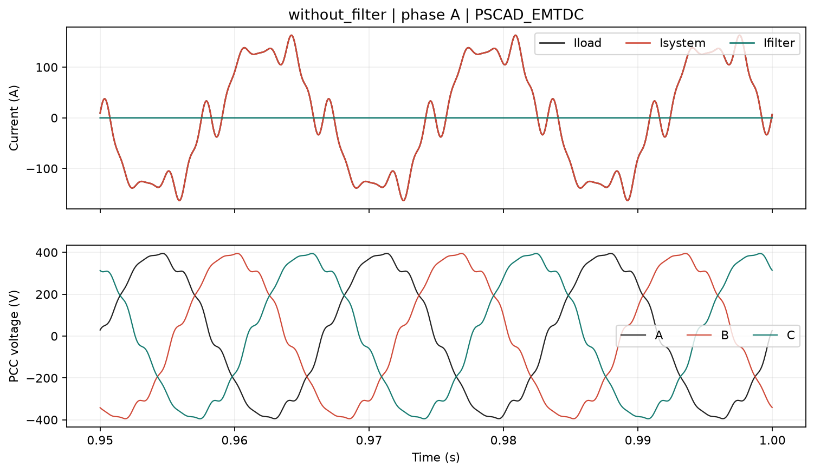
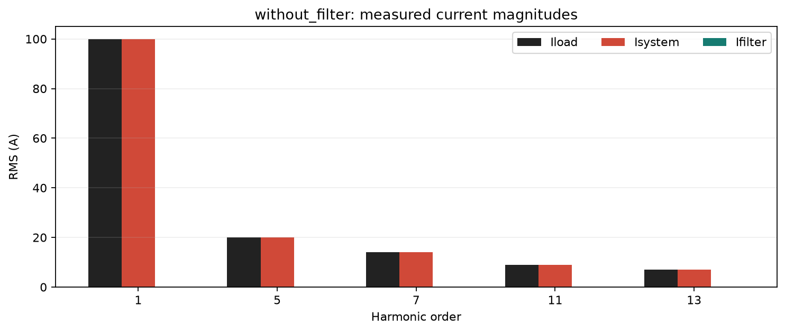

# Estudo de filtro harmonico passivo

Origem dos dados: **PSCAD_EMTDC**.

Validacao automatica: **PASS**.

Fasores RMS com referencia em seno e angulos referidos a t=0.
Correntes em A, tensoes em V. Iload entra no PCC; Isystem sai para a rede;
Ifilter sai para o filtro. Ilinear sai para a carga linear opcional.

KCL: Iload = Isystem + Ifilter + Ilinear. Com carga linear desativada, Ilinear=0.

Percentuais abaixo sao razoes de modulos. Nao sao parcelas escalares aditivas;
podem exceder 100%. As projecoes complexas constam dos CSV.

Na fundamental, a fonte de tensao tambem alimenta o filtro: os percentuais
nao representam exclusivamente a divisao da corrente injetada.

## without_filter

Filtro isolado pelo disjuntor; R=0.03199944 ohm, L=0.848812 mH, C=331.578555 uF; ft=300.000 Hz, Q=50.00.

| Ordem | Hz | Iload (A / deg) | Isystem (A / deg) | Ifilter (A / deg) | Filtro % | Sistema % | Erro KCL % |
| ---: | ---: | ---: | ---: | ---: | ---: | ---: | ---: |
| 1 | 60 | 100.0000 / -180.00 deg | 100.0000 / -180.00 deg | 2.752e-10 / n.a. | 0.00 | 100.00 | 9.2026e-14 |
| 5 | 300 | 20.0000 / -0.00 deg | 20.0000 / -0.00 deg | 7.551e-12 / n.a. | 0.00 | 100.00 | 2.9268e-13 |
| 7 | 420 | 14.0000 / 20.00 deg | 14.0000 / 20.00 deg | 7.395e-12 / n.a. | 0.00 | 100.00 | 2.0266e-13 |
| 11 | 660 | 9.0000 / -10.00 deg | 9.0000 / -10.00 deg | 7.468e-12 / n.a. | 0.00 | 100.00 | 5.2696e-13 |
| 13 | 780 | 7.0000 / 30.00 deg | 7.0000 / 30.00 deg | 6.864e-12 / n.a. | 0.00 | 100.00 | 5.0319e-13 |

| Canal fase A | RMS total | Fundamental RMS | THD % |
| --- | ---: | ---: | ---: |
| Iload_A | 103.5664 | 100.0000 | 26.944 |
| Isystem_A | 103.5664 | 100.0000 | 26.944 |
| Ifilter_A | 0.0000 | 0.0000 | nan |
| Ilinear_A | 0.0000 | 0.0000 | nan |
| Vpcc_A | 275.6211 | 275.2314 | 5.322 |

Dados completos: [without_filter/harmonics.csv](without_filter/harmonics.csv), [validacao](without_filter/validation.csv).
