# Estudo de filtro harmonico passivo

Origem dos dados: **ANALYTICAL_REFERENCE**.

Validacao automatica: **PASS**.

Fasores RMS com referencia em seno e angulos referidos a t=0.
Correntes em A, tensoes em V. Iload entra no PCC; Isystem sai para a rede;
Ifilter sai para o filtro. Ilinear sai para a carga linear opcional.

KCL: Iload = Isystem + Ifilter + Ilinear. Com carga linear desativada, Ilinear=0.

Percentuais abaixo sao razoes de modulos. Nao sao parcelas escalares aditivas;
podem exceder 100%. As projecoes complexas constam dos CSV.

Na fundamental, a fonte de tensao tambem alimenta o filtro: os percentuais
nao representam exclusivamente a divisao da corrente injetada.

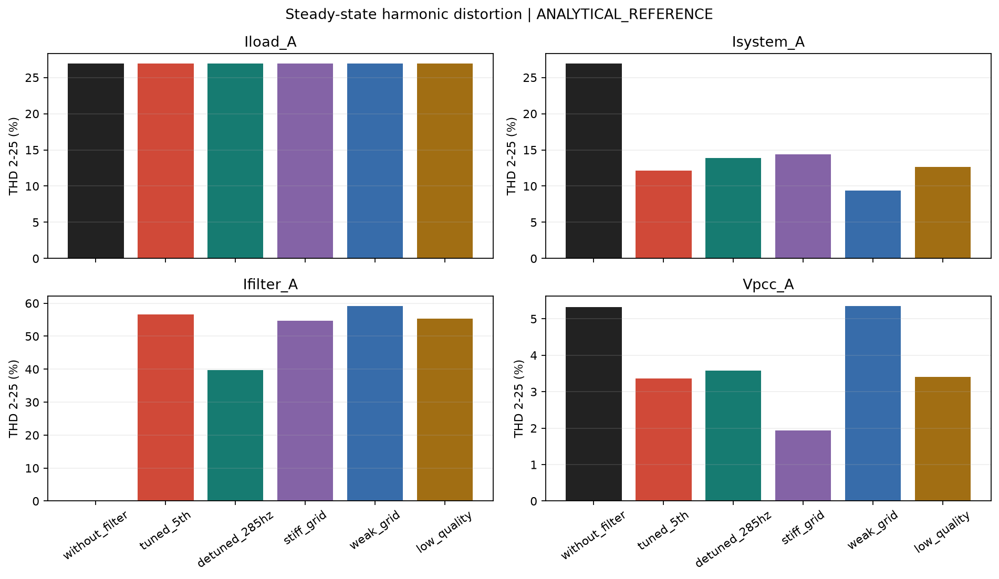

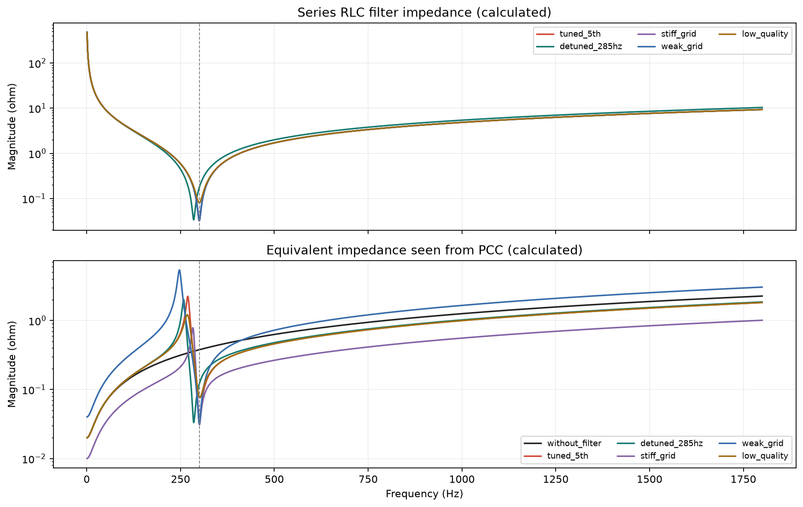

## without_filter

Filtro isolado pelo disjuntor; R=0.03199944 ohm, L=0.848812 mH, C=331.578555 uF; ft=300.000 Hz, Q=50.00.

| Ordem | Hz | Iload (A / deg) | Isystem (A / deg) | Ifilter (A / deg) | Filtro % | Sistema % | Erro KCL % |
| ---: | ---: | ---: | ---: | ---: | ---: | ---: | ---: |
| 1 | 60 | 100.0000 / -180.00 deg | 100.0000 / 180.00 deg | 0 / n.a. | 0.00 | 100.00 | 2.1711e-12 |
| 5 | 300 | 20.0000 / 0.00 deg | 20.0000 / 0.00 deg | 0 / n.a. | 0.00 | 100.00 | 1.8246e-13 |
| 7 | 420 | 14.0000 / 20.00 deg | 14.0000 / 20.00 deg | 0 / n.a. | 0.00 | 100.00 | 1.4811e-13 |
| 11 | 660 | 9.0000 / -10.00 deg | 9.0000 / -10.00 deg | 0 / n.a. | 0.00 | 100.00 | 2.9606e-14 |
| 13 | 780 | 7.0000 / 30.00 deg | 7.0000 / 30.00 deg | 0 / n.a. | 0.00 | 100.00 | 3.0505e-13 |

| Canal fase A | RMS total | Fundamental RMS | THD % |
| --- | ---: | ---: | ---: |
| Iload_A | 103.5664 | 100.0000 | 26.944 |
| Isystem_A | 103.5664 | 100.0000 | 26.944 |
| Ifilter_A | 0.0000 | 0.0000 | nan |
| Ilinear_A | 0.0000 | 0.0000 | nan |
| Vpcc_A | 275.6209 | 275.2314 | 5.322 |

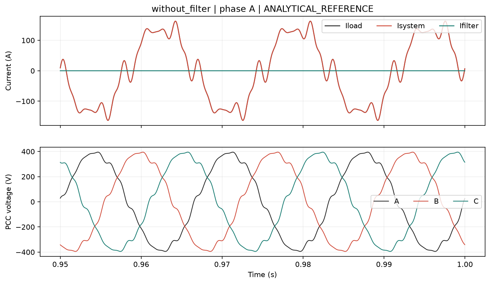

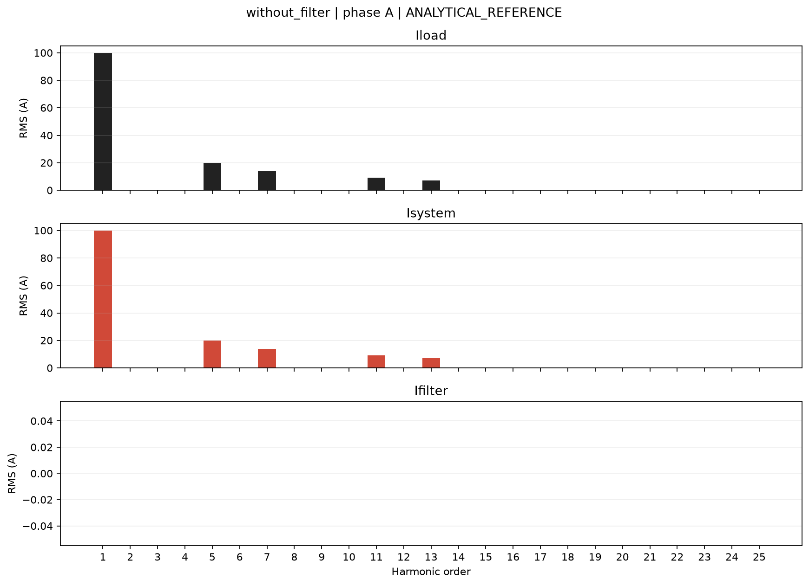

Dados completos: [without_filter/harmonics.csv](without_filter/harmonics.csv), [validacao](without_filter/validation.csv).

## tuned_5th

Filtro conectado; R=0.03199944 ohm, L=0.848812 mH, C=331.578555 uF; ft=300.000 Hz, Q=50.00.

| Ordem | Hz | Iload (A / deg) | Isystem (A / deg) | Ifilter (A / deg) | Filtro % | Sistema % | Erro KCL % |
| ---: | ---: | ---: | ---: | ---: | ---: | ---: | ---: |
| 1 | 60 | 100.0000 / -180.00 deg | 107.5066 / -160.34 deg | 36.1925 / 88.04 deg | 36.19 | 107.51 | 1.2028e-12 |
| 5 | 300 | 20.0000 / 0.00 deg | 1.6817 / -82.15 deg | 19.8403 / 4.82 deg | 99.20 | 8.41 | 7.4093e-12 |
| 7 | 420 | 14.0000 / 20.00 deg | 9.4518 / 20.16 deg | 4.5483 / 19.66 deg | 32.49 | 67.51 | 1.8372e-11 |
| 11 | 660 | 9.0000 / -10.00 deg | 6.9389 / -9.83 deg | 2.0612 / -10.56 deg | 22.90 | 77.10 | 8.1875e-13 |
| 13 | 780 | 7.0000 / 30.00 deg | 5.4835 / 30.14 deg | 1.5166 / 29.49 deg | 21.67 | 78.34 | 2.7967e-12 |

| Canal fase A | RMS total | Fundamental RMS | THD % |
| --- | ---: | ---: | ---: |
| Iload_A | 103.5664 | 100.0000 | 26.944 |
| Isystem_A | 108.2961 | 107.5066 | 12.142 |
| Ifilter_A | 41.6025 | 36.1925 | 56.683 |
| Ilinear_A | 0.0000 | 0.0000 | nan |
| Vpcc_A | 278.1134 | 277.9563 | 3.363 |

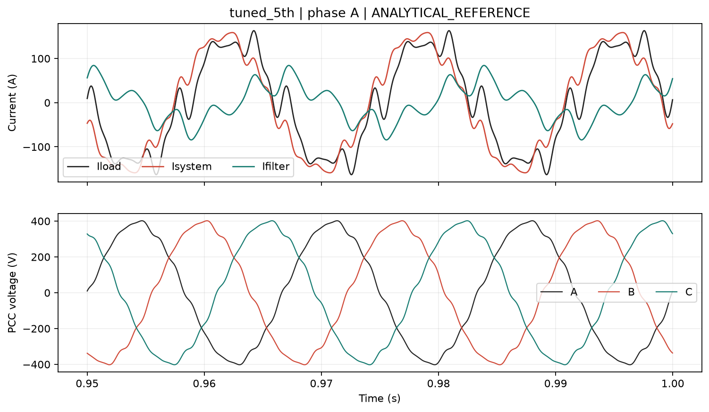

Dados completos: [tuned_5th/harmonics.csv](tuned_5th/harmonics.csv), [validacao](tuned_5th/validation.csv).

## detuned_285hz

Filtro conectado; R=0.03368363 ohm, L=0.940511 mH, C=331.578555 uF; ft=285.000 Hz, Q=50.00.

| Ordem | Hz | Iload (A / deg) | Isystem (A / deg) | Ifilter (A / deg) | Filtro % | Sistema % | Erro KCL % |
| ---: | ---: | ---: | ---: | ---: | ---: | ---: | ---: |
| 1 | 60 | 100.0000 / -180.00 deg | 107.5762 / -160.26 deg | 36.3578 / 88.02 deg | 36.36 | 107.58 | 8.6194e-13 |
| 5 | 300 | 20.0000 / 0.00 deg | 6.3752 / -5.45 deg | 13.6670 / 2.54 deg | 68.34 | 31.88 | 2.925e-12 |
| 7 | 420 | 14.0000 / 20.00 deg | 10.0411 / 20.21 deg | 3.9591 / 19.48 deg | 28.28 | 71.72 | 3.974e-12 |
| 11 | 660 | 9.0000 / -10.00 deg | 7.1347 / -9.84 deg | 1.8654 / -10.61 deg | 20.73 | 79.27 | 7.5715e-12 |
| 13 | 780 | 7.0000 / 30.00 deg | 5.6205 / 30.14 deg | 1.3796 / 29.45 deg | 19.71 | 80.29 | 6.25e-12 |

| Canal fase A | RMS total | Fundamental RMS | THD % |
| --- | ---: | ---: | ---: |
| Iload_A | 103.5664 | 100.0000 | 26.944 |
| Isystem_A | 108.6121 | 107.5762 | 13.911 |
| Ifilter_A | 39.1118 | 36.3578 | 39.653 |
| Ilinear_A | 0.0000 | 0.0000 | nan |
| Vpcc_A | 278.1471 | 277.9685 | 3.585 |

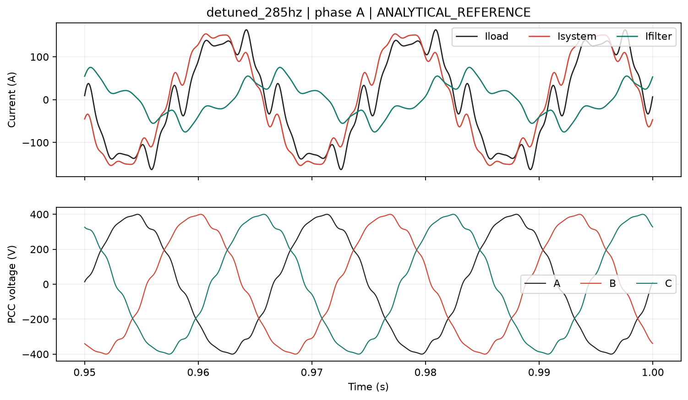

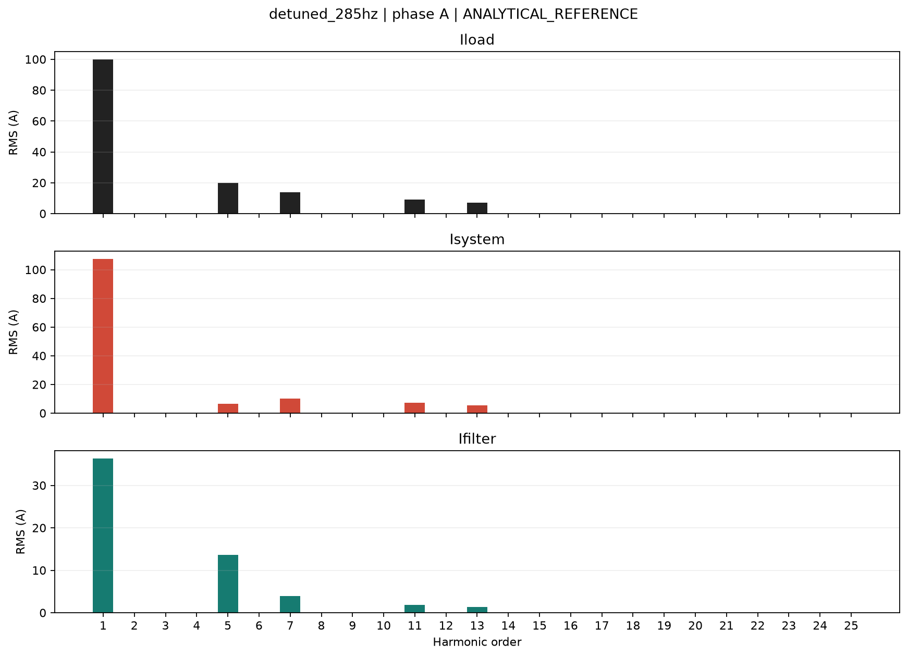

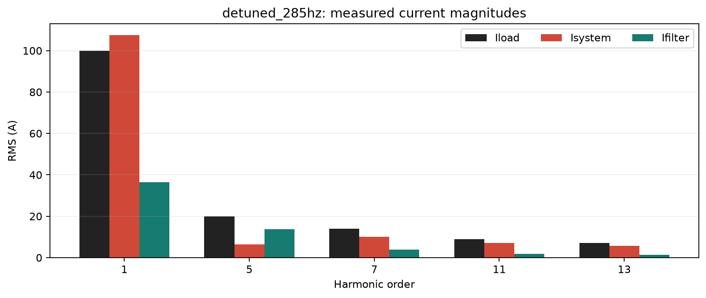

Dados completos: [detuned_285hz/harmonics.csv](detuned_285hz/harmonics.csv), [validacao](detuned_285hz/validation.csv).

## stiff_grid

Filtro conectado; R=0.03199944 ohm, L=0.848812 mH, C=331.578555 uF; ft=300.000 Hz, Q=50.00.

| Ordem | Hz | Iload (A / deg) | Isystem (A / deg) | Ifilter (A / deg) | Filtro % | Sistema % | Erro KCL % |
| ---: | ---: | ---: | ---: | ---: | ---: | ---: | ---: |
| 1 | 60 | 100.0000 / -180.00 deg | 106.9771 / -160.26 deg | 36.1350 / 88.90 deg | 36.13 | 106.98 | 3.7694e-12 |
| 5 | 300 | 20.0000 / 0.00 deg | 3.3140 / -77.44 deg | 19.5487 / 9.52 deg | 97.74 | 16.57 | 7.2042e-12 |
| 7 | 420 | 14.0000 / 20.00 deg | 11.2849 / 20.10 deg | 2.7152 / 19.60 deg | 19.39 | 80.61 | 1.414e-11 |
| 11 | 660 | 9.0000 / -10.00 deg | 7.8362 / -9.91 deg | 1.1639 / -10.63 deg | 12.93 | 87.07 | 6.1008e-12 |
| 13 | 780 | 7.0000 / 30.00 deg | 6.1496 / 30.08 deg | 0.8504 / 29.43 deg | 12.15 | 87.85 | 3.6131e-11 |

| Canal fase A | RMS total | Fundamental RMS | THD % |
| --- | ---: | ---: | ---: |
| Iload_A | 103.5664 | 100.0000 | 26.944 |
| Isystem_A | 108.0818 | 106.9771 | 14.408 |
| Ifilter_A | 41.1988 | 36.1350 | 54.764 |
| Ilinear_A | 0.0000 | 0.0000 | nan |
| Vpcc_A | 277.5665 | 277.5144 | 1.938 |

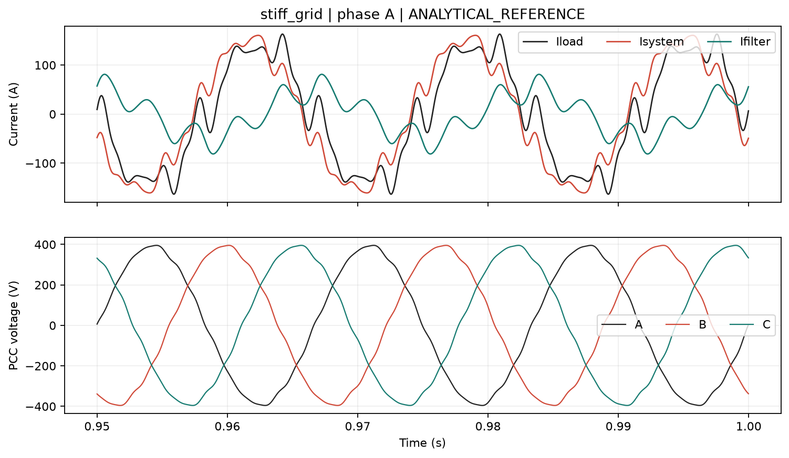

Dados completos: [stiff_grid/harmonics.csv](stiff_grid/harmonics.csv), [validacao](stiff_grid/validation.csv).

## weak_grid

Filtro conectado; R=0.03199944 ohm, L=0.848812 mH, C=331.578555 uF; ft=300.000 Hz, Q=50.00.

| Ordem | Hz | Iload (A / deg) | Isystem (A / deg) | Ifilter (A / deg) | Filtro % | Sistema % | Erro KCL % |
| ---: | ---: | ---: | ---: | ---: | ---: | ---: | ---: |
| 1 | 60 | 100.0000 / -180.00 deg | 108.5808 / -160.49 deg | 36.3301 / 86.29 deg | 36.33 | 108.58 | 5.5887e-13 |
| 5 | 300 | 20.0000 / 0.00 deg | 0.8450 / -84.55 deg | 19.9374 / 2.42 deg | 99.69 | 4.22 | 8.0041e-12 |
| 7 | 420 | 14.0000 / 20.00 deg | 7.1342 / 20.24 deg | 6.8660 / 19.75 deg | 49.04 | 50.96 | 8.5649e-12 |
| 11 | 660 | 9.0000 / -10.00 deg | 5.6459 / -9.73 deg | 3.3542 / -10.45 deg | 37.27 | 62.73 | 2.5106e-12 |
| 13 | 780 | 7.0000 / 30.00 deg | 4.5070 / 30.23 deg | 2.4931 / 29.58 deg | 35.62 | 64.39 | 4.2371e-11 |

| Canal fase A | RMS total | Fundamental RMS | THD % |
| --- | ---: | ---: | ---: |
| Iload_A | 103.5664 | 100.0000 | 26.944 |
| Isystem_A | 109.0577 | 108.5808 | 9.383 |
| Ifilter_A | 42.2135 | 36.3301 | 59.171 |
| Ilinear_A | 0.0000 | 0.0000 | nan |
| Vpcc_A | 279.4119 | 279.0125 | 5.353 |

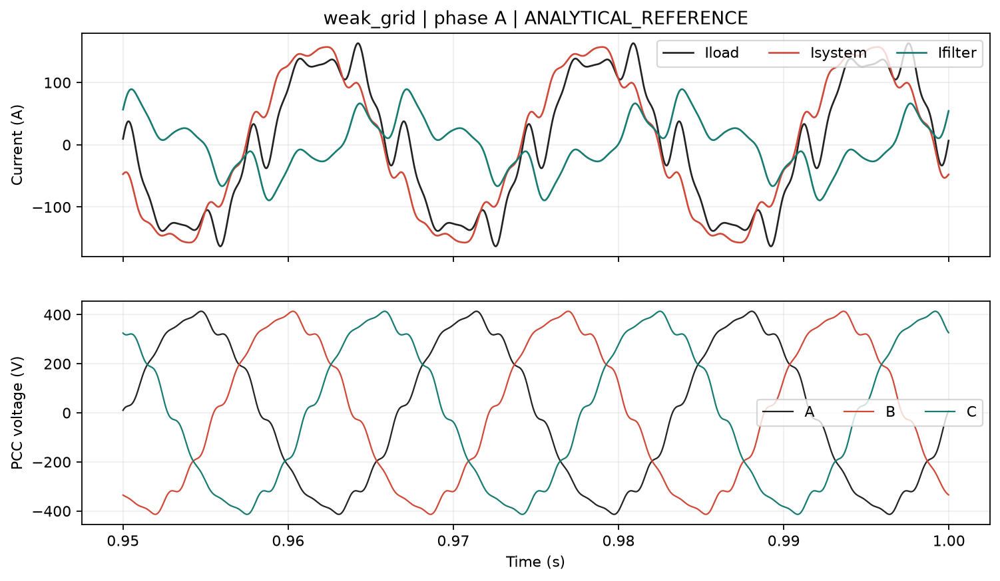

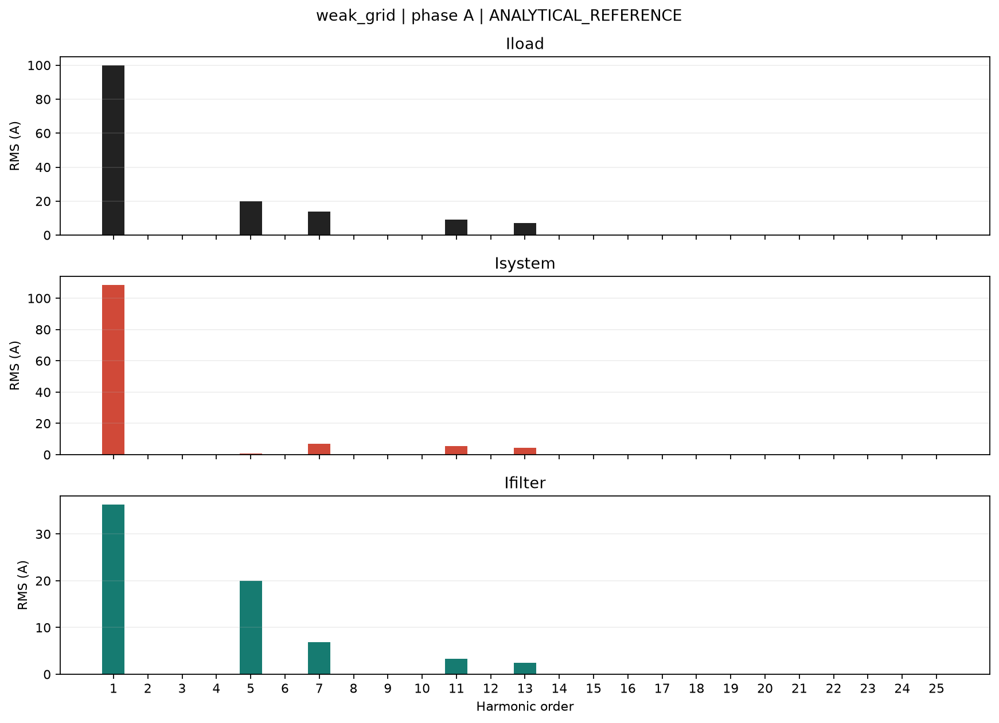

Dados completos: [weak_grid/harmonics.csv](weak_grid/harmonics.csv), [validacao](weak_grid/validation.csv).

## low_quality

Filtro conectado; R=0.07999861 ohm, L=0.848812 mH, C=331.578555 uF; ft=300.000 Hz, Q=20.00.

| Ordem | Hz | Iload (A / deg) | Isystem (A / deg) | Ifilter (A / deg) | Filtro % | Sistema % | Erro KCL % |
| ---: | ---: | ---: | ---: | ---: | ---: | ---: | ---: |
| 1 | 60 | 100.0000 / -180.00 deg | 107.7179 / -160.39 deg | 36.1903 / 87.68 deg | 36.19 | 107.72 | 3.4686e-12 |
| 5 | 300 | 20.0000 / 0.00 deg | 4.1022 / -75.14 deg | 19.3587 / 11.82 deg | 96.79 | 20.51 | 6.2607e-12 |
| 7 | 420 | 14.0000 / 20.00 deg | 9.4599 / 19.35 deg | 4.5420 / 21.35 deg | 32.44 | 67.57 | 1.8061e-12 |
| 11 | 660 | 9.0000 / -10.00 deg | 6.9394 / -10.06 deg | 2.0606 / -9.80 deg | 22.90 | 77.10 | 7.0997e-12 |
| 13 | 780 | 7.0000 / 30.00 deg | 5.4837 / 29.97 deg | 1.5163 / 30.10 deg | 21.66 | 78.34 | 4.5708e-11 |

| Canal fase A | RMS total | Fundamental RMS | THD % |
| --- | ---: | ---: | ---: |
| Iload_A | 103.5664 | 100.0000 | 26.944 |
| Isystem_A | 108.5711 | 107.7179 | 12.611 |
| Ifilter_A | 41.3723 | 36.1903 | 55.397 |
| Ilinear_A | 0.0000 | 0.0000 | nan |
| Vpcc_A | 278.1122 | 277.9514 | 3.402 |

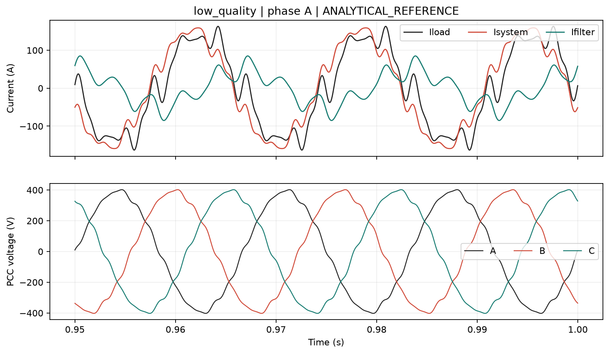

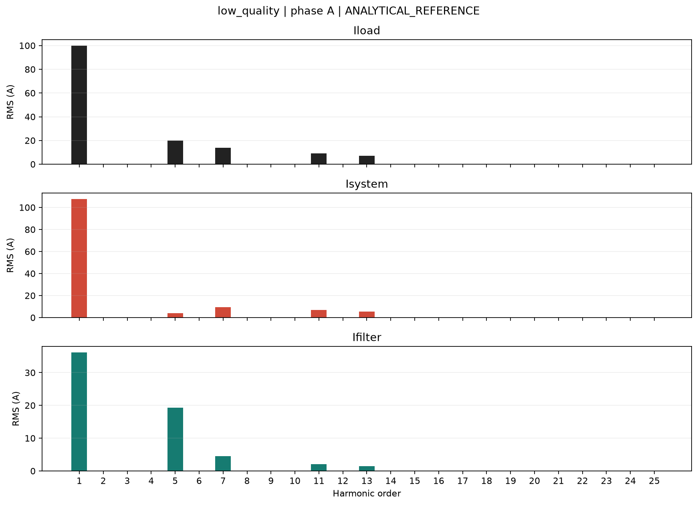

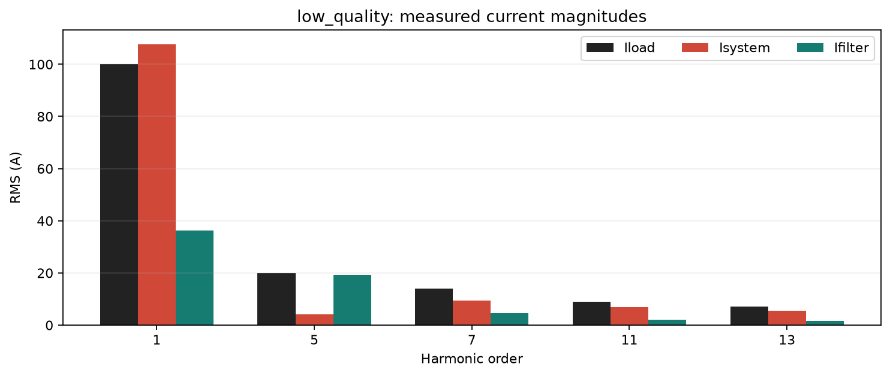

Dados completos: [low_quality/harmonics.csv](low_quality/harmonics.csv), [validacao](low_quality/validation.csv).
