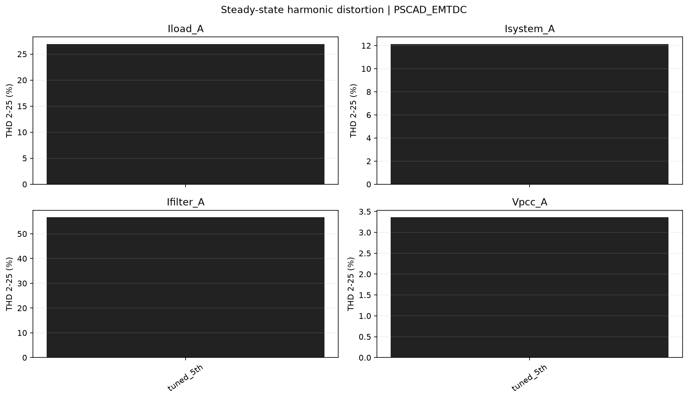
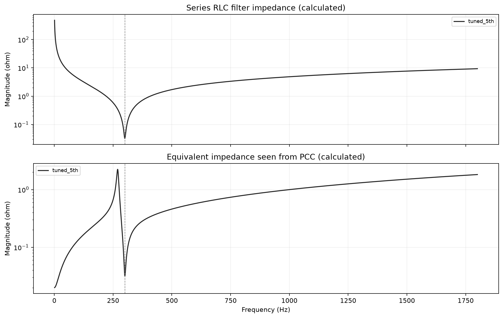
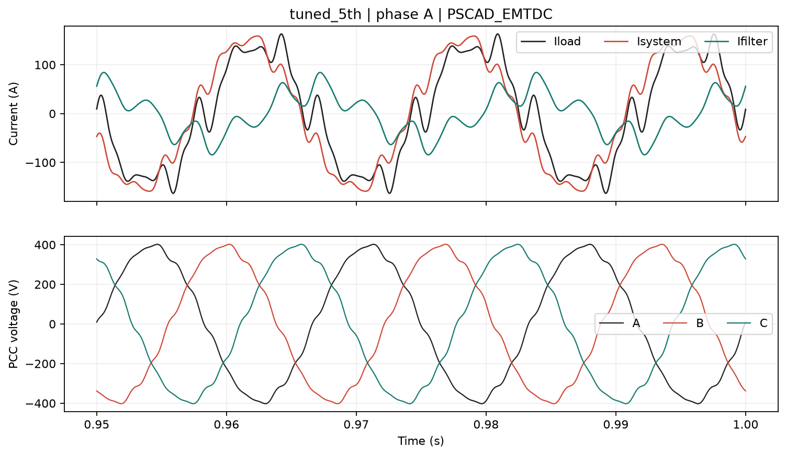
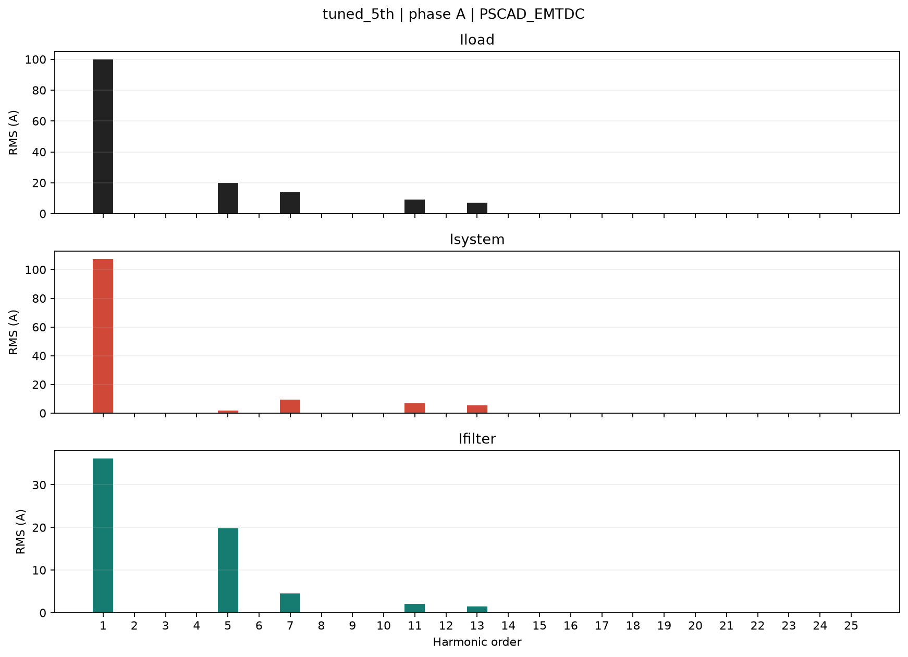

# Estudo de filtro harmonico passivo

Origem dos dados: **PSCAD_EMTDC**.

Validacao automatica: **PASS**.

Fasores RMS com referencia em seno e angulos referidos a t=0.
Correntes em A, tensoes em V. Iload entra no PCC; Isystem sai para a rede;
Ifilter sai para o filtro. Ilinear sai para a carga linear opcional.

KCL: Iload = Isystem + Ifilter + Ilinear. Com carga linear desativada, Ilinear=0.

Percentuais abaixo sao razoes de modulos. Nao sao parcelas escalares aditivas;
podem exceder 100%. As projecoes complexas constam dos CSV.

Na fundamental, a fonte de tensao tambem alimenta o filtro: os percentuais
nao representam exclusivamente a divisao da corrente injetada.

A THD depende tambem do modulo da fundamental. Neste exemplo, a carga
fundamental tem fator de potencia proximo da unidade e o filtro pode
aumentar o RMS total da corrente da rede por sobrecompensacao capacitiva.
Compare tambem os amperes harmonicos, nao apenas o percentual de THD.

## tuned_5th

Filtro conectado; R=0.03199944 ohm, L=0.848812 mH, C=331.578555 uF; ft=300.000 Hz, Q=50.00.

| Ordem | Hz | Iload (A / deg) | Isystem (A / deg) | Ifilter (A / deg) | Filtro % | Sistema % | Erro KCL % |
| ---: | ---: | ---: | ---: | ---: | ---: | ---: | ---: |
| 1 | 60 | 100.0000 / -180.00 deg | 107.5066 / -160.34 deg | 36.1925 / 88.04 deg | 36.19 | 107.51 | 3.6481e-14 |
| 5 | 300 | 20.0000 / -0.00 deg | 1.6816 / -82.10 deg | 19.8391 / 4.82 deg | 99.20 | 8.41 | 5.9093e-14 |
| 7 | 420 | 14.0000 / 20.00 deg | 9.4519 / 20.16 deg | 4.5482 / 19.66 deg | 32.49 | 67.51 | 1.936e-13 |
| 11 | 660 | 9.0000 / -10.00 deg | 6.9389 / -9.83 deg | 2.0612 / -10.56 deg | 22.90 | 77.10 | 4.1666e-13 |
| 13 | 780 | 7.0000 / 30.00 deg | 5.4835 / 30.14 deg | 1.5166 / 29.49 deg | 21.67 | 78.34 | 3.1619e-13 |

| Canal fase A | RMS total | Fundamental RMS | RMS h2-25 | THD % |
| --- | ---: | ---: | ---: | ---: |
| Iload_A | 103.5664 | 100.0000 | 26.9444 | 26.944 |
| Isystem_A | 108.2961 | 107.5066 | 13.0531 | 12.142 |
| Ifilter_A | 41.6020 | 36.1925 | 20.5140 | 56.680 |
| Ilinear_A | 0.0000 | 0.0000 | 0.0000 | nan |
| Vpcc_A | 278.1134 | 277.9563 | 9.3472 | 3.363 |

Dados completos: [tuned_5th/harmonics.csv](tuned_5th/harmonics.csv), [validacao](tuned_5th/validation.csv).
