# Estudo de filtro harmonico passivo

Origem dos dados: **PSCAD_EMTDC**.

Validacao automatica: **PASS**.

Fasores RMS com referencia em seno e angulos referidos a t=0.
Correntes em A, tensoes em V. Iload entra no PCC; Isystem sai para a rede;
Ifilter sai para o filtro. Ilinear sai para a carga linear opcional.

KCL: Iload = Isystem + Ifilter + Ilinear. Com carga linear desativada, Ilinear=0.

Percentuais abaixo sao razoes de modulos. Nao sao parcelas escalares aditivas;
podem exceder 100%. As projecoes complexas constam dos CSV.

Na fundamental, a fonte de tensao tambem alimenta o filtro: os percentuais
nao representam exclusivamente a divisao da corrente injetada.

A THD depende tambem do modulo da fundamental. Neste exemplo, a carga
fundamental tem fator de potencia proximo da unidade e o filtro pode
aumentar o RMS total da corrente da rede por sobrecompensacao capacitiva.
Compare tambem os amperes harmonicos, nao apenas o percentual de THD.

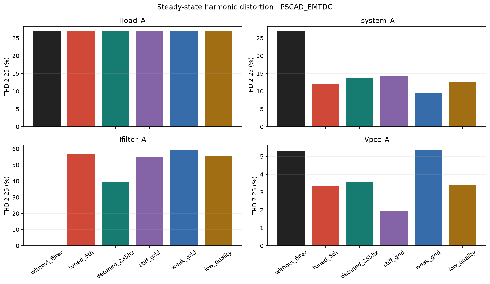

## without_filter

Filtro isolado pelo disjuntor; R=0.03199944 ohm, L=0.848812 mH, C=331.578555 uF; ft=300.000 Hz, Q=50.00.

| Ordem | Hz | Iload (A / deg) | Isystem (A / deg) | Ifilter (A / deg) | Filtro % | Sistema % | Erro KCL % |
| ---: | ---: | ---: | ---: | ---: | ---: | ---: | ---: |
| 1 | 60 | 100.0000 / -180.00 deg | 100.0000 / -180.00 deg | 2.752e-10 / n.a. | 0.00 | 100.00 | 9.2026e-14 |
| 5 | 300 | 20.0000 / -0.00 deg | 20.0000 / -0.00 deg | 7.551e-12 / n.a. | 0.00 | 100.00 | 2.9268e-13 |
| 7 | 420 | 14.0000 / 20.00 deg | 14.0000 / 20.00 deg | 7.395e-12 / n.a. | 0.00 | 100.00 | 2.0266e-13 |
| 11 | 660 | 9.0000 / -10.00 deg | 9.0000 / -10.00 deg | 7.468e-12 / n.a. | 0.00 | 100.00 | 5.2696e-13 |
| 13 | 780 | 7.0000 / 30.00 deg | 7.0000 / 30.00 deg | 6.864e-12 / n.a. | 0.00 | 100.00 | 5.0319e-13 |

| Canal fase A | RMS total | Fundamental RMS | RMS h2-25 | THD % |
| --- | ---: | ---: | ---: | ---: |
| Iload_A | 103.5664 | 100.0000 | 26.9444 | 26.944 |
| Isystem_A | 103.5664 | 100.0000 | 26.9444 | 26.944 |
| Ifilter_A | 0.0000 | 0.0000 | 0.0000 | nan |
| Ilinear_A | 0.0000 | 0.0000 | 0.0000 | nan |
| Vpcc_A | 275.6211 | 275.2314 | 14.6484 | 5.322 |

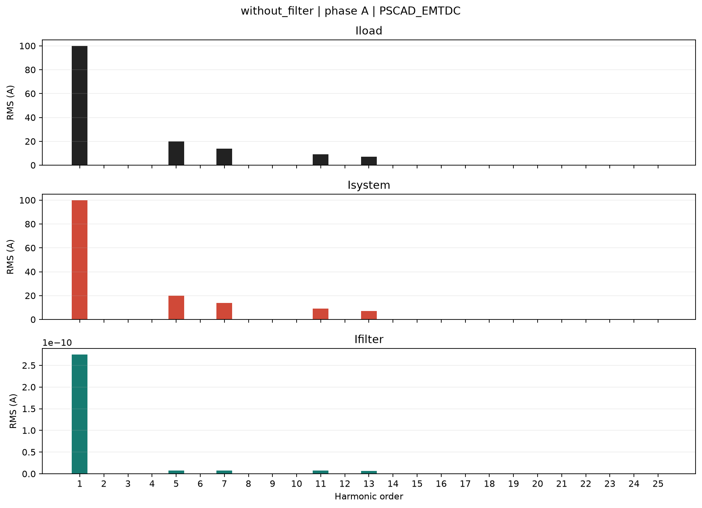

Dados completos: [without_filter/harmonics.csv](without_filter/harmonics.csv), [validacao](without_filter/validation.csv).

## tuned_5th

Filtro conectado; R=0.03199944 ohm, L=0.848812 mH, C=331.578555 uF; ft=300.000 Hz, Q=50.00.

| Ordem | Hz | Iload (A / deg) | Isystem (A / deg) | Ifilter (A / deg) | Filtro % | Sistema % | Erro KCL % |
| ---: | ---: | ---: | ---: | ---: | ---: | ---: | ---: |
| 1 | 60 | 100.0000 / -180.00 deg | 107.5066 / -160.34 deg | 36.1926 / 88.04 deg | 36.19 | 107.51 | 9.6092e-14 |
| 5 | 300 | 20.0000 / -0.00 deg | 1.6812 / -81.98 deg | 19.8354 / 4.81 deg | 99.18 | 8.41 | 1.882e-13 |
| 7 | 420 | 14.0000 / 20.00 deg | 9.4522 / 20.16 deg | 4.5479 / 19.66 deg | 32.49 | 67.52 | 2.5042e-13 |
| 11 | 660 | 9.0000 / -10.00 deg | 6.9390 / -9.83 deg | 2.0611 / -10.56 deg | 22.90 | 77.10 | 7.0619e-13 |
| 13 | 780 | 7.0000 / 30.00 deg | 5.4836 / 30.14 deg | 1.5165 / 29.49 deg | 21.66 | 78.34 | 7.6563e-13 |

| Canal fase A | RMS total | Fundamental RMS | RMS h2-25 | THD % |
| --- | ---: | ---: | ---: | ---: |
| Iload_A | 103.5664 | 100.0000 | 26.9444 | 26.944 |
| Isystem_A | 108.2962 | 107.5066 | 13.0534 | 12.142 |
| Ifilter_A | 41.6002 | 36.1926 | 20.5103 | 56.670 |
| Ilinear_A | 0.0000 | 0.0000 | 0.0000 | nan |
| Vpcc_A | 278.1135 | 277.9563 | 9.3484 | 3.363 |

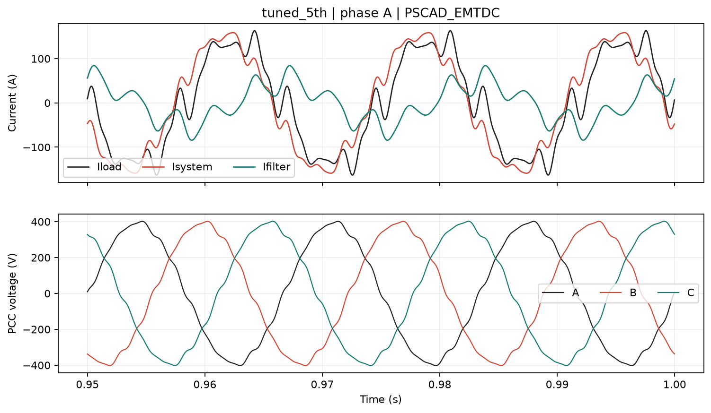

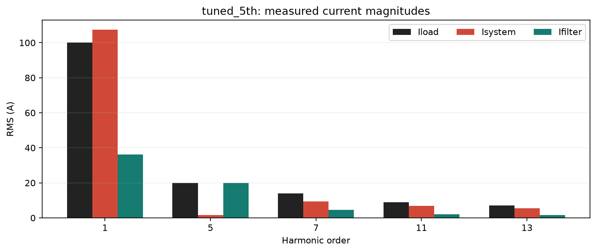

Dados completos: [tuned_5th/harmonics.csv](tuned_5th/harmonics.csv), [validacao](tuned_5th/validation.csv).

## detuned_285hz

Filtro conectado; R=0.03368363 ohm, L=0.940511 mH, C=331.578555 uF; ft=285.000 Hz, Q=50.00.

| Ordem | Hz | Iload (A / deg) | Isystem (A / deg) | Ifilter (A / deg) | Filtro % | Sistema % | Erro KCL % |
| ---: | ---: | ---: | ---: | ---: | ---: | ---: | ---: |
| 1 | 60 | 100.0000 / -180.00 deg | 107.5762 / -160.26 deg | 36.3578 / 88.02 deg | 36.36 | 107.58 | 1.1496e-13 |
| 5 | 300 | 20.0000 / -0.00 deg | 6.3775 / -5.45 deg | 13.6647 / 2.54 deg | 68.32 | 31.89 | 3.7765e-13 |
| 7 | 420 | 14.0000 / 20.00 deg | 10.0414 / 20.21 deg | 3.9588 / 19.48 deg | 28.28 | 71.72 | 2.4581e-13 |
| 11 | 660 | 9.0000 / -10.00 deg | 7.1348 / -9.84 deg | 1.8653 / -10.61 deg | 20.73 | 79.28 | 3.4233e-13 |
| 13 | 780 | 7.0000 / 30.00 deg | 5.6206 / 30.14 deg | 1.3795 / 29.45 deg | 19.71 | 80.29 | 1.0813e-12 |

| Canal fase A | RMS total | Fundamental RMS | RMS h2-25 | THD % |
| --- | ---: | ---: | ---: | ---: |
| Iload_A | 103.5664 | 100.0000 | 26.9444 | 26.944 |
| Isystem_A | 108.6123 | 107.5762 | 14.9666 | 13.913 |
| Ifilter_A | 39.1110 | 36.3578 | 14.4145 | 39.646 |
| Ilinear_A | 0.0000 | 0.0000 | 0.0000 | nan |
| Vpcc_A | 278.1473 | 277.9685 | 9.9675 | 3.586 |

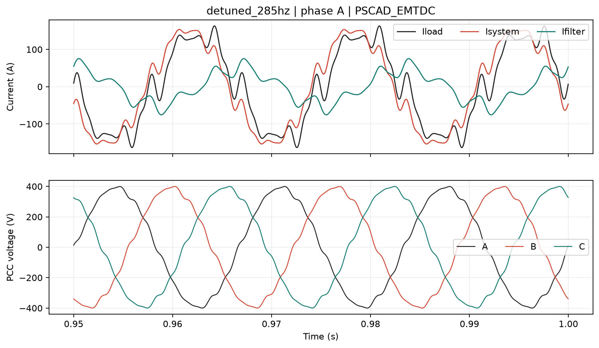

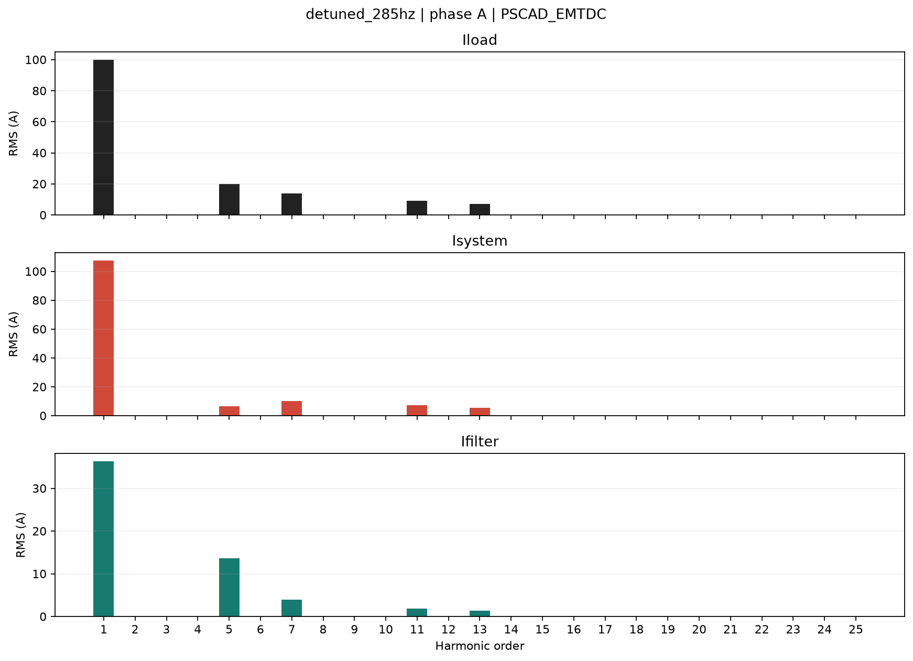

Dados completos: [detuned_285hz/harmonics.csv](detuned_285hz/harmonics.csv), [validacao](detuned_285hz/validation.csv).

## stiff_grid

Filtro conectado; R=0.03199944 ohm, L=0.848812 mH, C=331.578555 uF; ft=300.000 Hz, Q=50.00.

| Ordem | Hz | Iload (A / deg) | Isystem (A / deg) | Ifilter (A / deg) | Filtro % | Sistema % | Erro KCL % |
| ---: | ---: | ---: | ---: | ---: | ---: | ---: | ---: |
| 1 | 60 | 100.0000 / -180.00 deg | 106.9772 / -160.26 deg | 36.1350 / 88.90 deg | 36.14 | 106.98 | 1.3829e-13 |
| 5 | 300 | 20.0000 / -0.00 deg | 3.3123 / -77.28 deg | 19.5394 / 9.52 deg | 97.70 | 16.56 | 1.6305e-13 |
| 7 | 420 | 14.0000 / 20.00 deg | 11.2852 / 20.10 deg | 2.7149 / 19.60 deg | 19.39 | 80.61 | 2.1876e-13 |
| 11 | 660 | 9.0000 / -10.00 deg | 7.8363 / -9.91 deg | 1.1638 / -10.63 deg | 12.93 | 87.07 | 7.4964e-13 |
| 13 | 780 | 7.0000 / 30.00 deg | 6.1497 / 30.08 deg | 0.8504 / 29.43 deg | 12.15 | 87.85 | 9.2246e-13 |

| Canal fase A | RMS total | Fundamental RMS | RMS h2-25 | THD % |
| --- | ---: | ---: | ---: | ---: |
| Iload_A | 103.5664 | 100.0000 | 26.9444 | 26.944 |
| Isystem_A | 108.0818 | 106.9772 | 15.4127 | 14.407 |
| Ifilter_A | 41.1944 | 36.1350 | 19.7797 | 54.738 |
| Ilinear_A | 0.0000 | 0.0000 | 0.0000 | nan |
| Vpcc_A | 277.5665 | 277.5144 | 5.3790 | 1.938 |

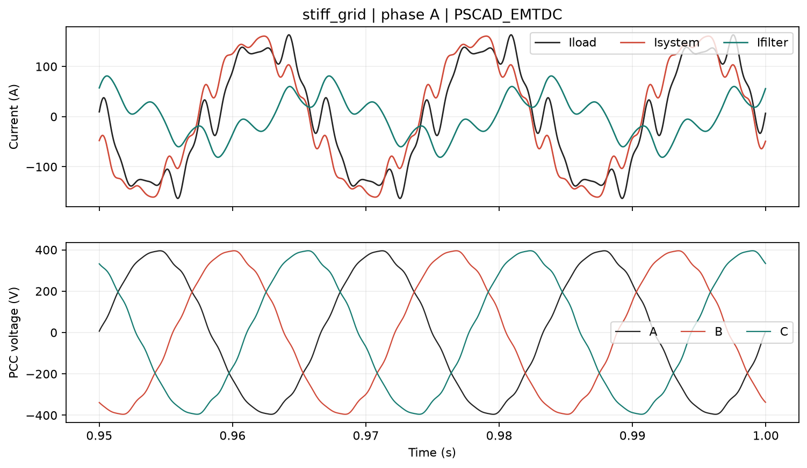

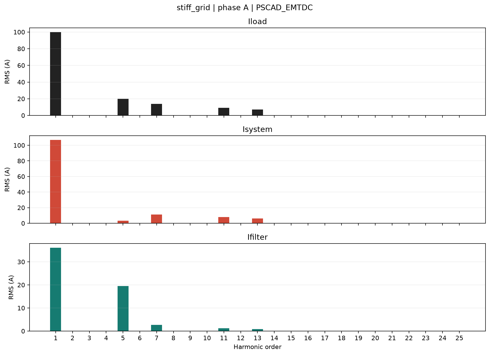

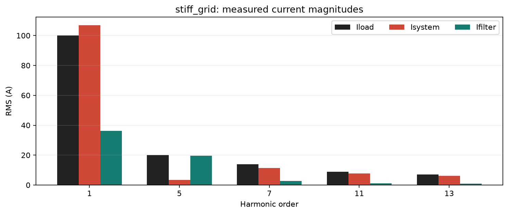

Dados completos: [stiff_grid/harmonics.csv](stiff_grid/harmonics.csv), [validacao](stiff_grid/validation.csv).

## weak_grid

Filtro conectado; R=0.03199944 ohm, L=0.848812 mH, C=331.578555 uF; ft=300.000 Hz, Q=50.00.

| Ordem | Hz | Iload (A / deg) | Isystem (A / deg) | Ifilter (A / deg) | Filtro % | Sistema % | Erro KCL % |
| ---: | ---: | ---: | ---: | ---: | ---: | ---: | ---: |
| 1 | 60 | 100.0000 / -180.00 deg | 108.5808 / -160.49 deg | 36.3301 / 86.29 deg | 36.33 | 108.58 | 1.4512e-13 |
| 5 | 300 | 20.0000 / -0.00 deg | 0.8448 / -84.38 deg | 19.9350 / 2.42 deg | 99.67 | 4.22 | 3.8093e-13 |
| 7 | 420 | 14.0000 / 20.00 deg | 7.1346 / 20.25 deg | 6.8656 / 19.75 deg | 49.04 | 50.96 | 3.2113e-13 |
| 11 | 660 | 9.0000 / -10.00 deg | 5.6461 / -9.73 deg | 3.3541 / -10.45 deg | 37.27 | 62.73 | 1.6115e-13 |
| 13 | 780 | 7.0000 / 30.00 deg | 4.5071 / 30.23 deg | 2.4930 / 29.58 deg | 35.61 | 64.39 | 4.7598e-13 |

| Canal fase A | RMS total | Fundamental RMS | RMS h2-25 | THD % |
| --- | ---: | ---: | ---: | ---: |
| Iload_A | 103.5664 | 100.0000 | 26.9444 | 26.944 |
| Isystem_A | 109.0578 | 108.5808 | 10.1886 | 9.383 |
| Ifilter_A | 42.2123 | 36.3301 | 21.4943 | 59.164 |
| Ilinear_A | 0.0000 | 0.0000 | 0.0000 | nan |
| Vpcc_A | 279.4123 | 279.0125 | 14.9376 | 5.354 |

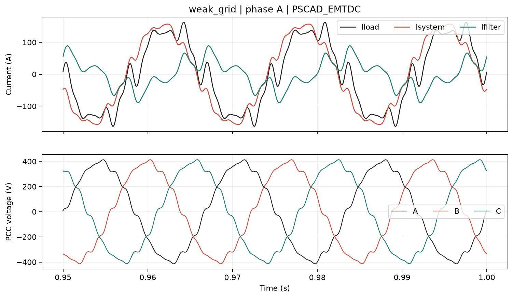

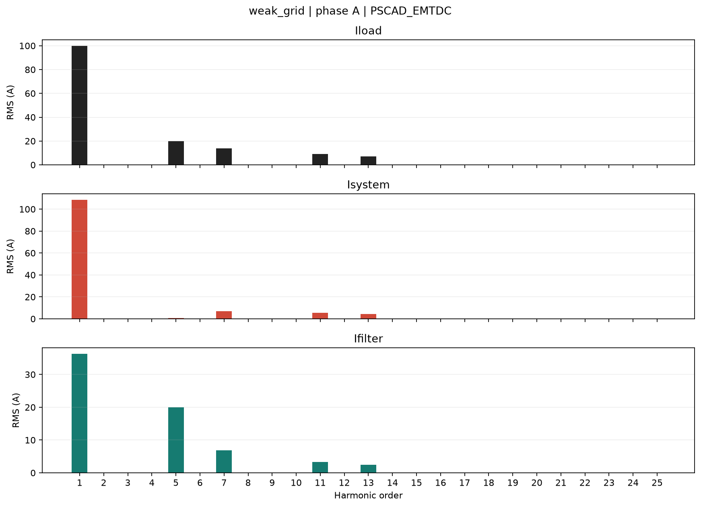

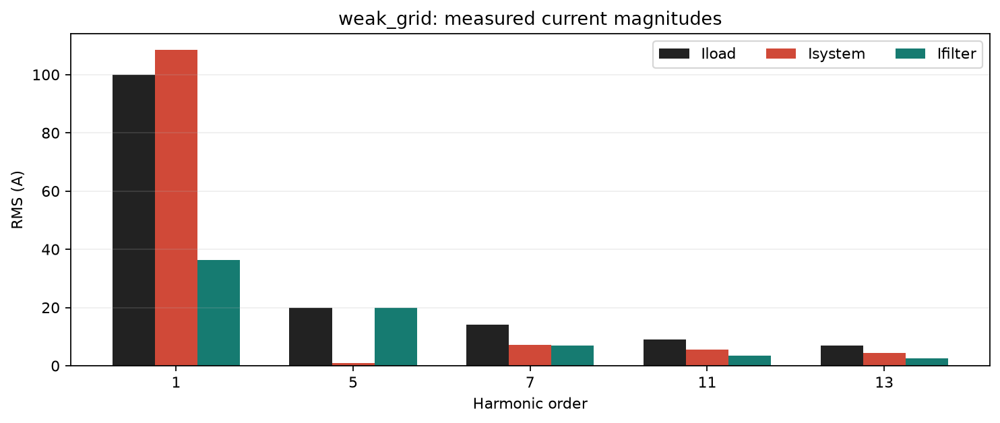

Dados completos: [weak_grid/harmonics.csv](weak_grid/harmonics.csv), [validacao](weak_grid/validation.csv).

## low_quality

Filtro conectado; R=0.07999861 ohm, L=0.848812 mH, C=331.578555 uF; ft=300.000 Hz, Q=20.00.

| Ordem | Hz | Iload (A / deg) | Isystem (A / deg) | Ifilter (A / deg) | Filtro % | Sistema % | Erro KCL % |
| ---: | ---: | ---: | ---: | ---: | ---: | ---: | ---: |
| 1 | 60 | 100.0000 / -180.00 deg | 107.7179 / -160.39 deg | 36.1903 / 87.68 deg | 36.19 | 107.72 | 1.1327e-13 |
| 5 | 300 | 20.0000 / -0.00 deg | 4.1011 / -75.08 deg | 19.3542 / 11.82 deg | 96.77 | 20.51 | 1.6246e-13 |
| 7 | 420 | 14.0000 / 20.00 deg | 9.4602 / 19.35 deg | 4.5416 / 21.35 deg | 32.44 | 67.57 | 3.0663e-13 |
| 11 | 660 | 9.0000 / -10.00 deg | 6.9395 / -10.06 deg | 2.0605 / -9.80 deg | 22.89 | 77.11 | 3.1755e-13 |
| 13 | 780 | 7.0000 / 30.00 deg | 5.4838 / 29.97 deg | 1.5162 / 30.10 deg | 21.66 | 78.34 | 7.3621e-13 |

| Canal fase A | RMS total | Fundamental RMS | RMS h2-25 | THD % |
| --- | ---: | ---: | ---: | ---: |
| Iload_A | 103.5664 | 100.0000 | 26.9444 | 26.944 |
| Isystem_A | 108.5711 | 107.7179 | 13.5847 | 12.611 |
| Ifilter_A | 41.3702 | 36.1903 | 20.0438 | 55.385 |
| Ilinear_A | 0.0000 | 0.0000 | 0.0000 | nan |
| Vpcc_A | 278.1123 | 277.9514 | 9.4570 | 3.402 |

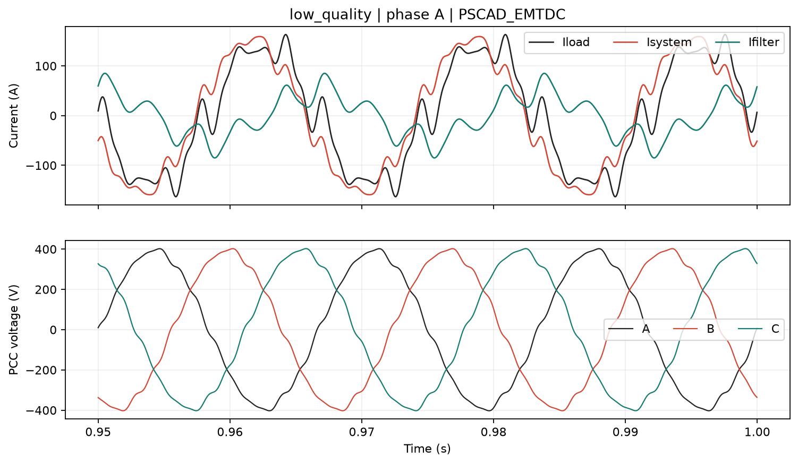

Dados completos: [low_quality/harmonics.csv](low_quality/harmonics.csv), [validacao](low_quality/validation.csv).
