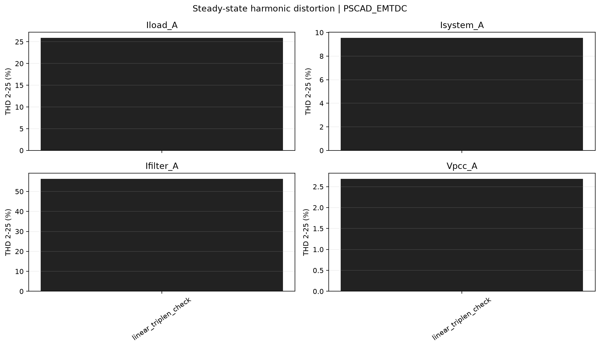
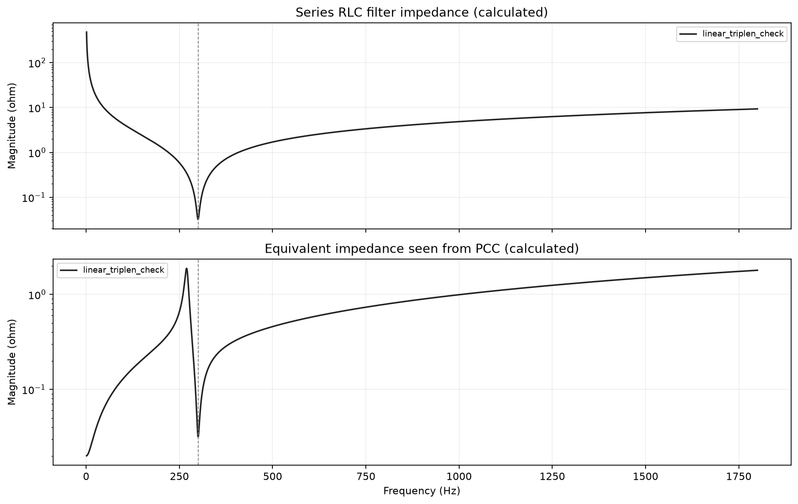
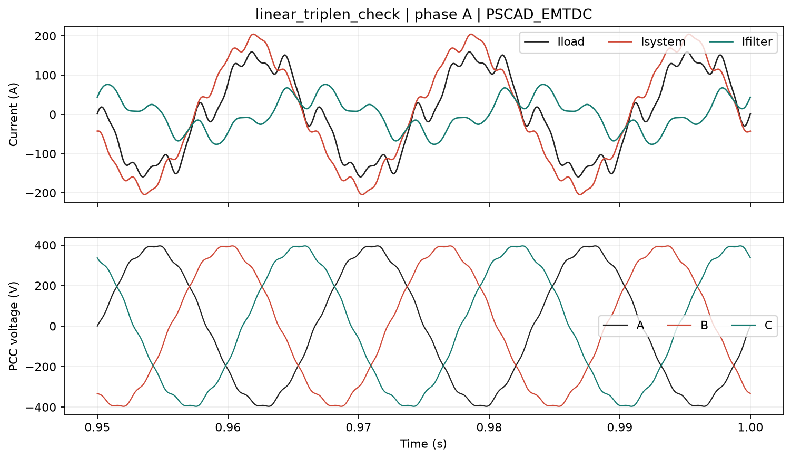
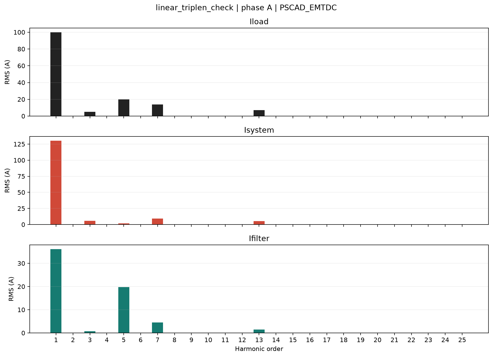
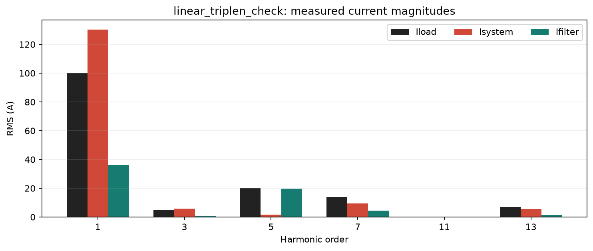

# Estudo de filtro harmonico passivo

Origem dos dados: **PSCAD_EMTDC**.

Validacao automatica: **PASS**.

Fasores RMS com referencia em seno e angulos referidos a t=0.
Correntes em A, tensoes em V. Iload entra no PCC; Isystem sai para a rede;
Ifilter sai para o filtro. Ilinear sai para a carga linear opcional.

KCL: Iload = Isystem + Ifilter + Ilinear. Com carga linear desativada, Ilinear=0.

Percentuais abaixo sao razoes de modulos. Nao sao parcelas escalares aditivas;
podem exceder 100%. As projecoes complexas constam dos CSV.

Na fundamental, a fonte de tensao tambem alimenta o filtro: os percentuais
nao representam exclusivamente a divisao da corrente injetada.

A THD depende tambem do modulo da fundamental. Neste exemplo, a carga
fundamental tem fator de potencia proximo da unidade e o filtro pode
aumentar o RMS total da corrente da rede por sobrecompensacao capacitiva.
Compare tambem os amperes harmonicos, nao apenas o percentual de THD.

## linear_triplen_check

Filtro conectado; R=0.03199944 ohm, L=0.848812 mH, C=331.578555 uF; ft=300.000 Hz, Q=50.00.

| Ordem | Hz | Iload (A / deg) | Isystem (A / deg) | Ifilter (A / deg) | Filtro % | Sistema % | Erro KCL % |
| ---: | ---: | ---: | ---: | ---: | ---: | ---: | ---: |
| 1 | 60 | 100.0000 / -180.00 deg | 130.3888 / -164.33 deg | 36.1278 / 87.66 deg | 36.13 | 130.39 | 8.3831e-14 |
| 3 | 180 | 5.0000 / 15.00 deg | 5.7463 / 12.77 deg | 0.7645 / -173.36 deg | 15.29 | 114.93 | 3.466e-13 |
| 5 | 300 | 20.0000 / -25.00 deg | 1.6770 / -107.12 deg | 19.7847 / -20.20 deg | 98.92 | 8.38 | 1.5956e-13 |
| 7 | 420 | 14.0000 / 20.00 deg | 9.4372 / 18.39 deg | 4.5411 / 17.89 deg | 32.44 | 67.41 | 2.6293e-13 |
| 11 | 660 | 2.244e-11 / n.a. | 2.075e-11 / n.a. | 2.87e-11 / n.a. | nan | nan | nan |
| 13 | 780 | 7.0000 / 30.00 deg | 5.4648 / 26.33 deg | 1.5114 / 25.68 deg | 21.59 | 78.07 | 6.2758e-13 |

| Canal fase A | RMS total | Fundamental RMS | RMS h2-25 | THD % |
| --- | ---: | ---: | ---: | ---: |
| Iload_A | 103.2957 | 100.0000 | 25.8844 | 25.884 |
| Isystem_A | 130.9809 | 130.3888 | 12.4402 | 9.541 |
| Ifilter_A | 41.4746 | 36.1278 | 20.3697 | 56.382 |
| Ilinear_A | 24.0937 | 24.0850 | 0.6476 | 2.689 |
| Vpcc_A | 277.5591 | 277.4588 | 7.4603 | 2.689 |

Dados completos: [linear_triplen_check/harmonics.csv](linear_triplen_check/harmonics.csv), [validacao](linear_triplen_check/validation.csv).
